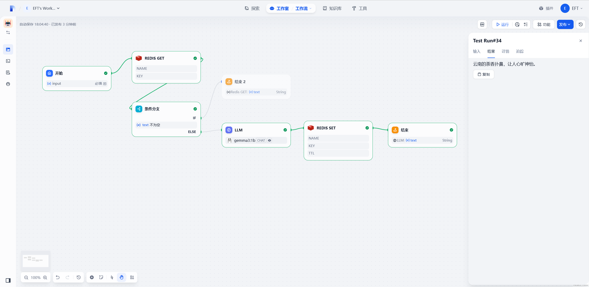
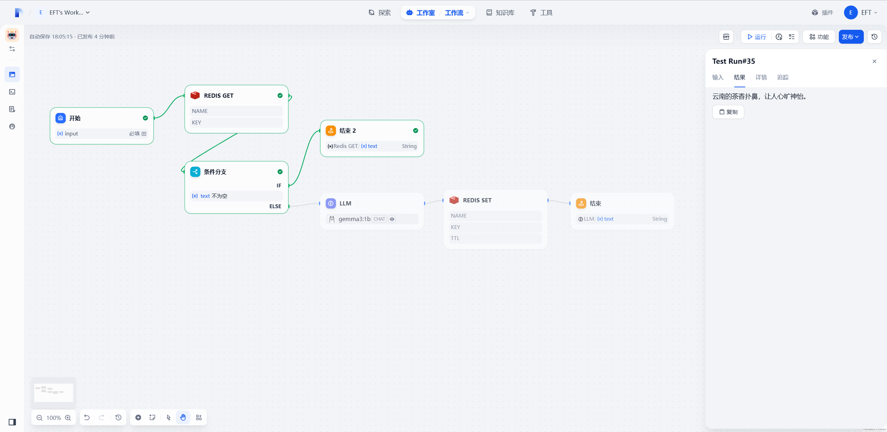
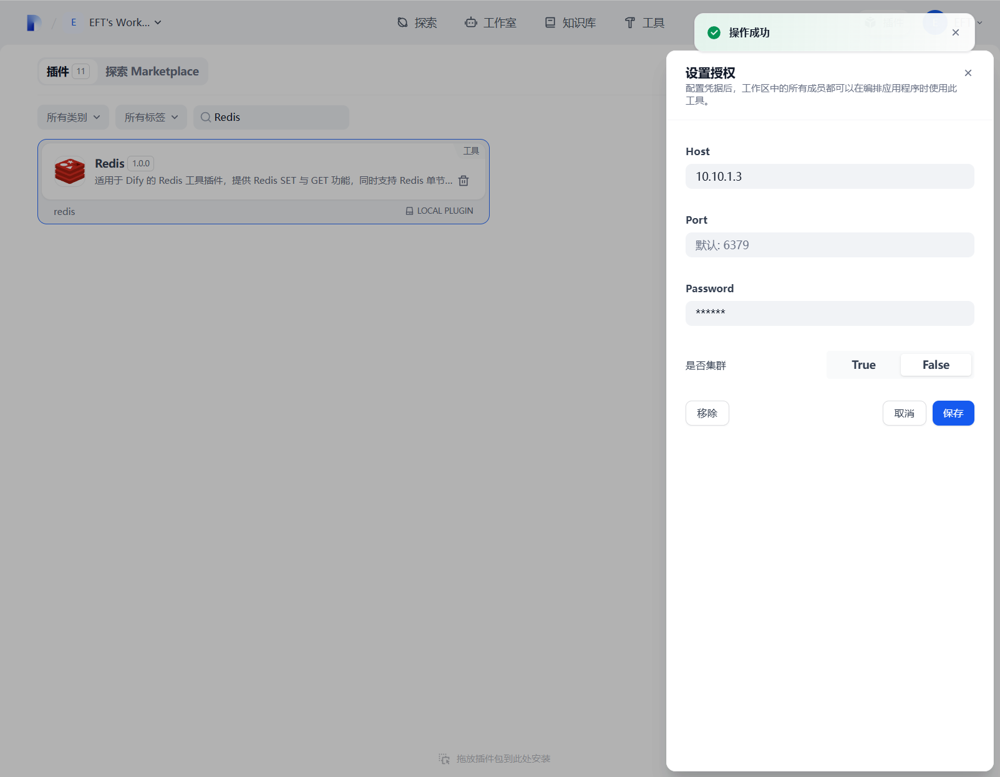
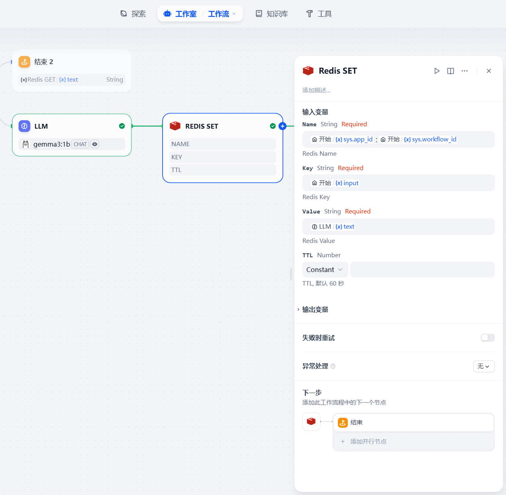
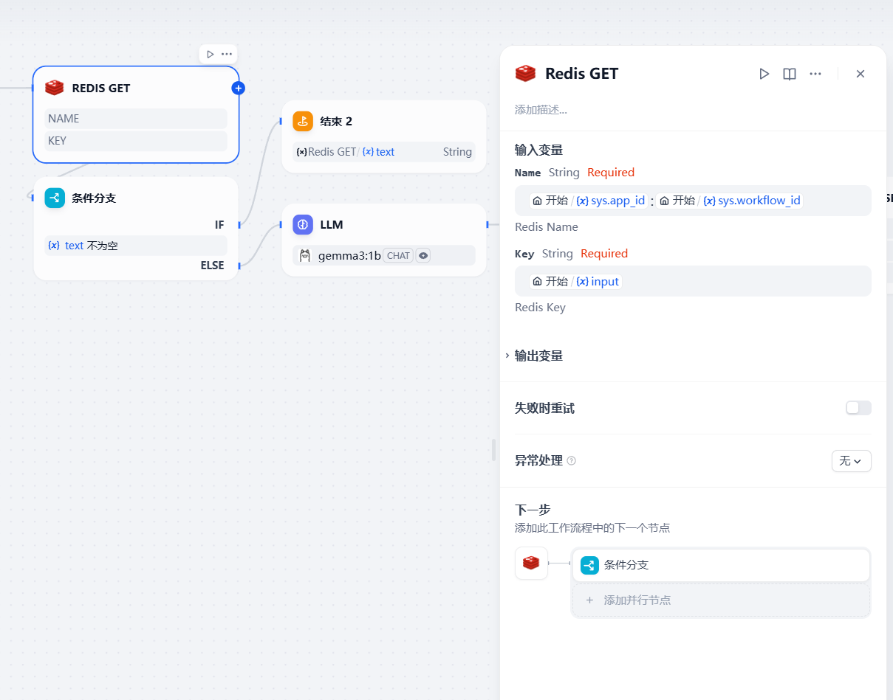

# Dify Redis Plugin

**Author:** [EFT](https://github.com/ztistic)
**Repo:** [dify-plugin-redis](https://github.com/ztistic/dify-plugin-redis)
**Version:** 1.0.1
**Type:** tool

## Description

This Dify Redis plugin provides Redis SET and GET functionalities,
allowing the caching of model-generated data in Redis to reduce server load.

### Examples

- Cache the output of LLM into Redis.

- Read cache from Redis if exists.

### Authorize

Set up authorization, which actually connects to the Redis server provided by user.

#### Features

- Connect to Redis Server, Redis Cluster is supported too.

#### Parameters

| Parameter  | Type     | Required | Description                                           |
|------------|----------|----------|-------------------------------------------------------|
| `host`     | `string` | `No`     | redis server host, default `127.0.0.1`.               |
| `port`     | `number` | `No`     | redis server port, default `6379`.                    |
| `password` | `string` | `No`     | redis server password, default `None`.                |
| `cluster`  | `bool`   | `No`     | redis cluster or not, default `False`.                |
| `db`       | `number` | `No`     | redis db, not supported in cluster mode, default `0`. |

### Redis SET

The Redis SET tool allows users write data into Redis.

#### Features

- Write data into Redis, the input string value is returned if success, or standard error is thrown.

#### Parameters

| Parameter | Type     | Required | Description                                              |
|-----------|----------|----------|----------------------------------------------------------|
| `name`    | `string` | `Yes`    | name of a redis record, part of the final redis key.     |
| `key`     | `string` | `Yes`    | key of a redis record, part of the final redis key.      |
| `value`   | `string` | `Yes`    | value of a redis record.                                 |
| `ttl`     | `number` | `No`     | TTL of a redis record, default `60`s, `-1` is supported. |

### Redis GET

The Redis GET tool allows users to read data from Redis.

#### Features

- Read data from Redis and returns standard output and standard error

#### Parameters

| Parameter | Type     | Required | Description                                          |
|-----------|----------|----------|------------------------------------------------------|
| `name`    | `string` | `Yes`    | name of a redis record, part of the final redis key. |
| `key`     | `string` | `Yes`    | key of a redis record, part of the final redis key.  |

## Security Considerations

- Ensure you have permission to access the target redis server
- Sensitive information such as password should be kept secure
- Follow the principle of least privilege, granting only necessary execution permissions

## License

[MIT](./LICENSE)

