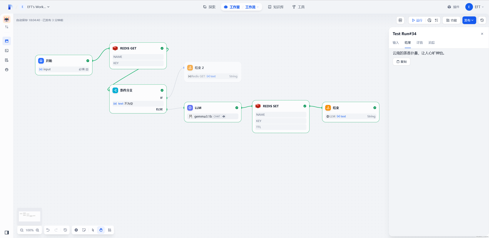
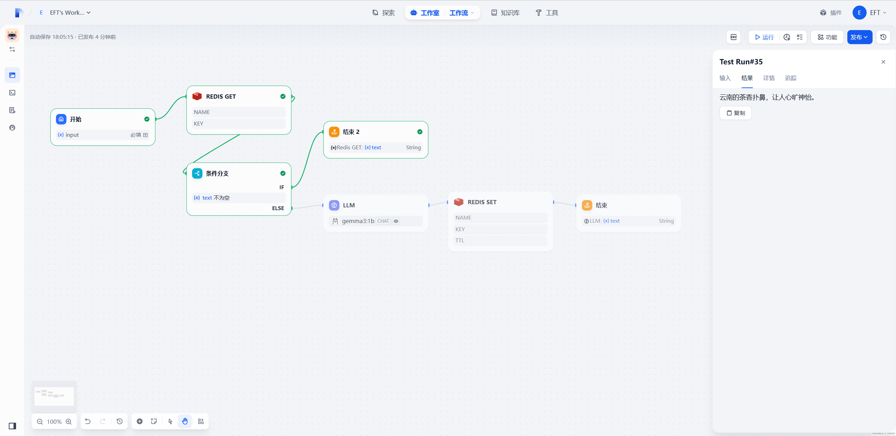

# Dify Redis Plugin

**Author:** [EFT](https://github.com/ztistic)
**Repo:** [dify-plugin-redis](https://github.com/ztistic/dify-plugin-redis)
**Version:** 1.0.4
**Type:** tool

## Description

This Dify Redis plugin provides Redis SET and GET tools, allowing you to cache
model-generated data in Redis to reduce server load and cost.

## Requirements

- Dify 1.14.2 or later
- A reachable Redis server (single-node or cluster mode)

## Installation

1. From Dify Marketplace: search "Redis" in the Plugins page and install.
2. Or install from a local `.difypkg`: Plugins → Install Plugin → Via Local File.

## Setup

Configure the Redis connection in the plugin's authorization page:

| Parameter  | Type     | Required | Description                                              |
|------------|----------|----------|----------------------------------------------------------|
| `host`     | `string` | `No`     | Redis server host, default `127.0.0.1`                   |
| `port`     | `string` | `No`     | Redis server port (numeric value), default `6379`        |
| `password` | `string` | `No`     | Redis server password, default none                      |
| `cluster`  | `bool`   | `No`     | Whether the server runs in cluster mode, default `false` |
| `db`       | `string` | `No`     | Redis database index (numeric value, single-node only), default `0` |

> Note: `port` and `db` are rendered as text inputs in Dify but should be numeric values. `db` is ignored in cluster mode.

## Tools

### Redis SET

Write data into Redis. Returns the input value on success, or raises an error.

| Parameter | Type     | Required | Description                                        |
|-----------|----------|----------|----------------------------------------------------|
| `name`    | `string` | `Yes`    | Name part of the final Redis key                    |
| `key`     | `string` | `Yes`    | Key part of the final Redis key                     |
| `value`   | `string` | `Yes`    | Value to store                                     |
| `ttl`     | `number` | `No`     | Time-to-live in seconds. Default `60`; `-1` = no expiry |

The final Redis key is `{name}:{key}`.

### Redis GET

Read data from Redis. Returns the stored value, or an empty string if the key
does not exist.

| Parameter | Type     | Required | Description                     |
|-----------|----------|----------|---------------------------------|
| `name`    | `string` | `Yes`    | Name part of the final Redis key |
| `key`     | `string` | `Yes`    | Key part of the final Redis key  |

The final Redis key is `{name}:{key}`.

## Examples

- Cache the output of LLM into Redis.

- Read cache from Redis if exists.

## Security Considerations

- Keep your Redis credentials secure
- Grant the least privileges needed (e.g. restrict via Redis ACL)
- Traffic to Redis is plain TCP by default; use TLS for remote/untrusted servers
- See [PRIVACY.md](./PRIVACY.md) for how this plugin handles data

## License

[MIT](./LICENSE)
